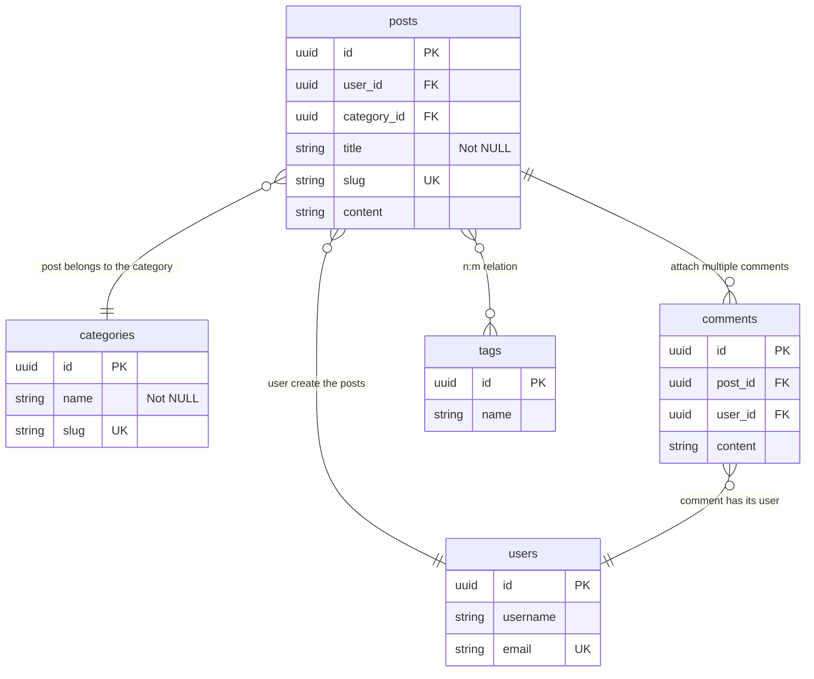

```mermaid
erDiagram
    users {
        uuid id PK
        string username
        string email UK
    }

    categories {
        uuid id PK
        string name "Not NULL"
        string slug UK
    }

    posts {
        uuid id PK
        uuid user_id FK
        uuid category_id FK
        string title "Not NULL"
        string slug UK
        string content
    }

    comments {
        uuid id PK
        uuid post_id FK
        uuid user_id FK
        string content
    }

    tags {
        uuid id PK
        string name
    }

    posts }o--|| users: "user create the posts"
    posts ||--o{ comments: "attach multiple comments"
    posts }o--|| categories: "post belongs to the category"
    comments }o--|| users: "comment has its user"
    posts }o--o{ tags: "n:m relation"
```